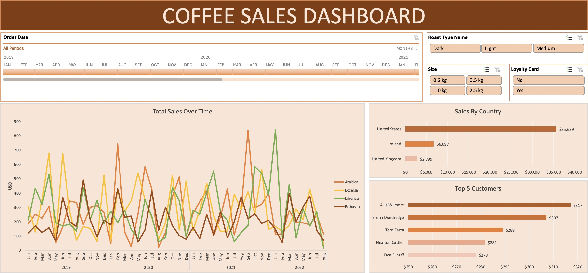

# ☕ Coffee Sales Dashboard | Microsoft Excel

An interactive sales analytics dashboard built entirely in Microsoft Excel, consolidating order, customer, and product data into a dynamic reporting tool with cross-linked filters and visual charts.

---

## 📌 Project Overview

This project simulates a real-world business intelligence workflow using Excel. Raw sales data was spread across three relational sheets with several missing fields. Using lookup formulas, calculated columns, and pivot-based visualizations, the data was cleaned, enriched, and presented in a fully interactive dashboard — all without any external tools or programming languages.

---

## 📂 Data Structure

The workbook contains three core data sheets:

| Sheet | Description |
|---|---|
| `Orders` | Transactional records — the primary sheet where missing fields were populated |
| `Customers` | Customer master data including customer ID, customer name, email, country, and loyalty card status |
| `Products` | Product catalog with product ID, coffee type, roast type, size, and unit price |

---

## 🔧 Data Preparation

### Populating Customer Fields via XLOOKUP

Several columns in the `Orders` sheet were missing and needed to be pulled from the `Customers` sheet using the Customer ID as the lookup key.

**Customer Name**
```excel
=XLOOKUP(C2,customers!$A$1:$A$1001,customers!$B$1:$B$1001,,0)
```

**Email** *(with blank handling for missing entries)*
```excel
=IF(XLOOKUP(C2,customers!$A$1:$A$1001,customers!$C$1:$C$1001,,0)=0,"",XLOOKUP(C2,customers!$A$1:$A$1001,customers!$C$1:$C$1001,,0))
```

**Country**
```excel
=XLOOKUP(C2,customers!$A$1:$A$1001,customers!$G$1:$G$1001,,0)
```

**Loyalty Card** *(new column added to Orders)*
```excel
=XLOOKUP([@[Customer ID]],customers!$A$1:$A$1001,customers!$I$1:$I$1001,,0)
```

---

### Populating Product Fields via INDEX/MATCH

Coffee type, roast type, size, and unit price were all retrieved from the `Products` sheet using a single dynamic formula with dual-axis matching — matching both the Product ID (row) and the column header (column).

```excel
=INDEX(products!$A$1:$G$49,MATCH(orders!$D2,products!$A$1:$A$49,0),MATCH(orders!I$1,products!$A$1:$G$1,0))
```

> This formula was reused across all four product columns simply by changing the column reference in the header match, making it highly efficient and easy to maintain.

---

### Calculating Sales Revenue

The `Sales` column was populated by multiplying unit price by quantity:

```excel
= Unit Price × Quantity
```

---

### Decoding Abbreviations with Nested IF

The raw data used shorthand codes for coffee and roast types. These were expanded into full names for readability in charts and filters.

**Coffee Type Name**
```excel
=IF(I2="Rob","Robusta",IF(I2="Exc","Excelsa",IF(I2="Ara","Arabica",IF(I2="Lib","Liberica",""))))
```

| Code | Full Name |
|---|---|
| Rob | Robusta |
| Exc | Excelsa |
| Ara | Arabica |
| Lib | Liberica |

**Roast Type Name**
```excel
=IF(J2="M","Medium",IF(J2="L","Light",IF(J2="D","Dark","")))
```

| Code | Full Name |
|---|---|
| M | Medium |
| L | Light |
| D | Dark |

---

## 📊 Dashboard

The dashboard was built using **Pivot Tables** and **Pivot Charts** derived from the enriched `Orders` sheet.



### Charts Included

| Chart | Description |
|---|---|
| 📈 Total Sales Over Time | Line chart tracking revenue trends across the order date range |
| 🌍 Sales by Country | Bar chart comparing total sales across customer countries |
| 🏆 Top 5 Customers | Bar chart highlighting the five highest-spending customers |

---

### 🎛️ Interactive Filters

All slicers and the timeline are connected to every chart simultaneously, enabling seamless cross-segment analysis from a single filter action.

| Filter | Type | Field |
|---|---|---|
| Order Date | Timeline | `Order Date` |
| Roast Type | Slicer | `Roast Type Name` |
| Size | Slicer | `Size` |
| Loyalty Card | Slicer | `Loyalty Card` |

---

## 🛠️ Tools & Techniques Used

- **Microsoft Excel**
- XLOOKUP
- INDEX / MATCH
- Nested IF statements
- Pivot Tables
- Pivot Charts
- Slicers & Timeline Filters
- Dashboard Design
